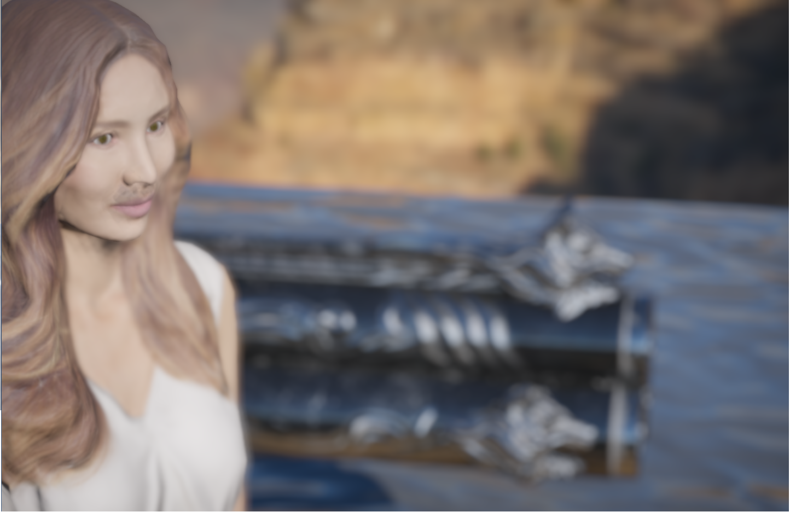

# Update after ugly covid-19 pandemic 5/12/2020
Finally I've managed to get runtime atmosphere working(thanks to the great work and detailed doc from https://github.com/ebruneton/precomputed_atmospheric_scattering), along with a runtime IBL images generating scheme.

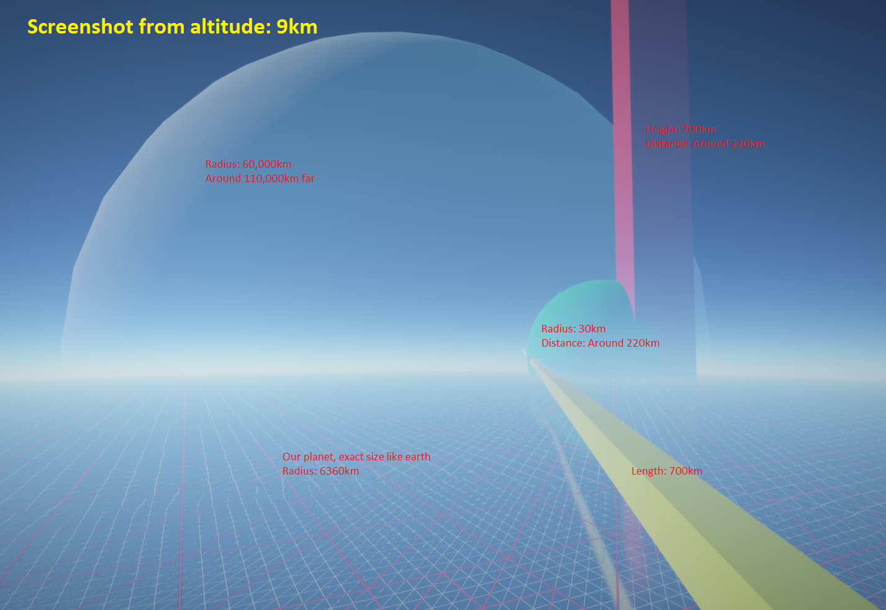

What you can do:
1. Keep pressing right mouse button and dragging is able to rotate your camera.
2. Keep pressing left mouse button and dragging is able to change sun position to your screen mouse position.
3. Buttons "w, s, a, d, q, e" and dragging right mouse button provide the functionality to navigate inside the since
4. Button "f" increases camera focus distance which creates a stronger effect of depth of field. Button "l" works exactly the opposite.
5. Button "t" stops updating camera info to GPU per frame buffer, so you could examine the backface and frustum culling of planet vertices.
6. Button "r": I added this button to switch the altitude of our scene between 9km and 10m, to observe the different view caused by the thickness of the atmosphere.

# A Render lab built on top of Vulkan

## How To Build
This project works **ONLY FOR WINDOWS** for now. But it could be ported to other platforms potentially by touching only a few parts of code.
 - **Install Vulkan SDK**
 
	Visit [https://vulkan.lunarg.com/sdk/home](https://vulkan.lunarg.com/sdk/home), download sdk and install Vulkan SDK. You'll have "VK_SDK_PATH" automatically.
 - **Install CMake**
 
	 Visit [https://cmake.org/download/](https://cmake.org/download/), download and install CMake.
 - **Generate Project**
 
	Open command prompt, direct to the root of your local clone(E.g. "C:\VulkanLearn" for me), and type **cmake . -G "Visual Studio [version] Win64"**(E.g. [version]=15 2017 for me). Open generated project and build.

## Introduction
I created this project aiming to get familiar with Vulkan through varies common rendering technologies. It is also a minor engine that handles scene management and data to coordinate with underlay Vulkan and get things drawn on screen. I've already added a lot of functionalities helping to create a scene by a few lines of code. However, there's still a vast gap between this project and a common game engine, both in terms of utilities that helps to ease the work, and a UI editor to do things dynamically rather than code stuff and rebuild.
## Scene Graph
The scene graph of this application is similar to unity. I mean I implemented them the way exactly as how unity works. The whole scene is combined with many objects and each of them might contain one or more components that handles varies kinds of work.

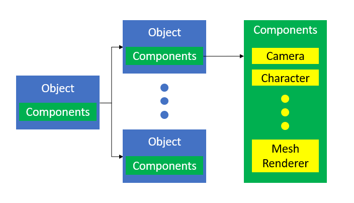
## Frame Graph
### Frame Work
I use triple ring swapchain images as a base count to organize rendering work per-frame. Each one of frames has its index used to acquire corresponding resources as well as synchronization primitives.

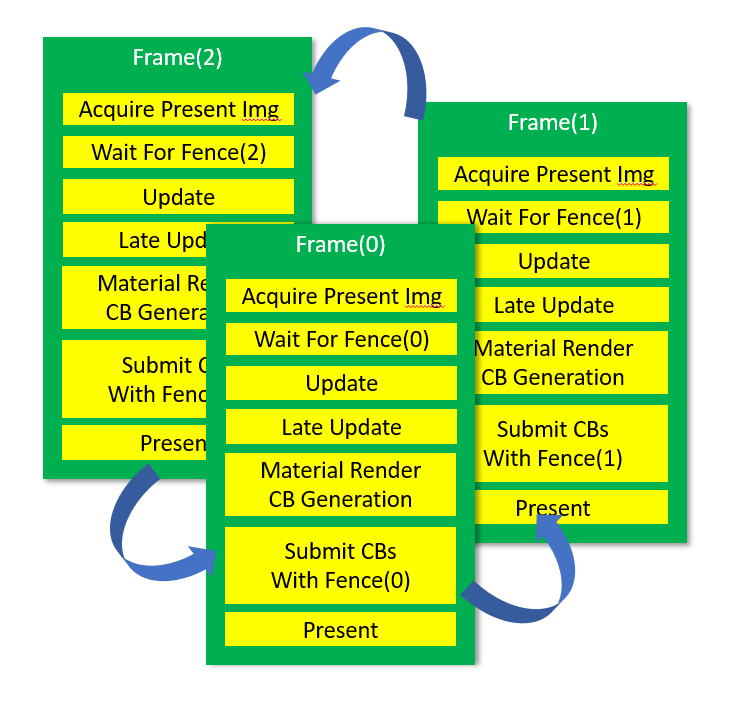
### Frame Resources
Every frame of a specific index 0, 1 and 2 holds its own resources, including command pool, frame buffers and synchronization primitives. I don't use per-frame descriptor pool however, since I allocated 3 times larger space of every uniforms and bind them with specific offset according to frame index, so that I don't really have to change descriptor sets and descriptor pools.

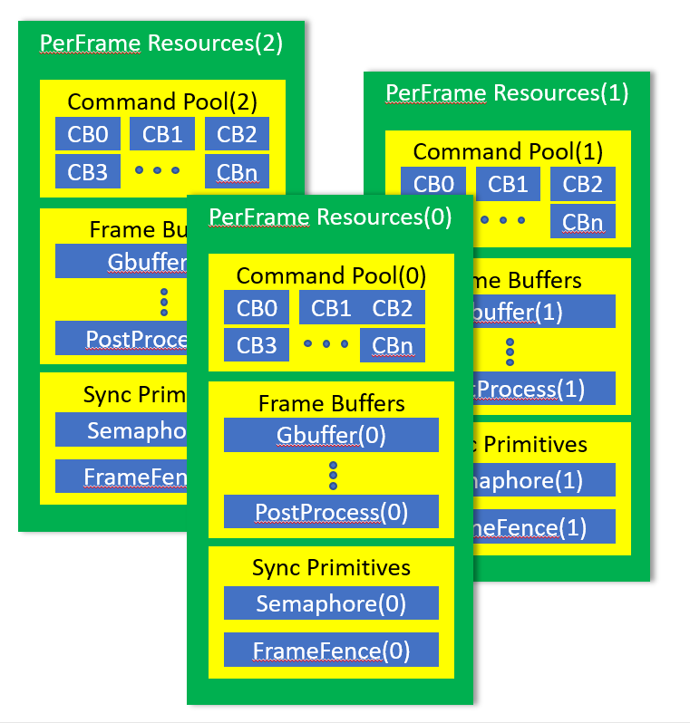
## Memory Management
Memory management is sophisticated in my project. There're 2 levels of memory management, memory level that is the management of relationship between memory and its holders(buffers, images), and buffer & image level, as the name suggests, it manages both buffers & images memory, to ease the use of them during rendering organization, and avoid per-frame operations to improve performance.
### Memory Level Management
Memory level management isn't actually general, since you can't just simply allocate a chunk of memory for everything. Buffers and Images must be bound to separate memory(At least validation layer told me so), and different images cannot share the same memory(Also told by validation layer). Therefore, I separated memory usage to buffer and image.
#### Memory Management for buffers
There'll be 32 chunks of memory in "Buffer Memory Pool", exactly the same as Vulkan physical device provided "VK_MAX_MEMORY_TYPES", and each of them consists of a size, data ptr, handle to Vulkan memory objects, and a KEY. The key here is very important as it acts as a role to index the actual binding information, and it'll be generated and kept by each buffer, to look up informations in binding table, and using "type index" to acquire Vulkan memory object from "Buffer Memory Pool"

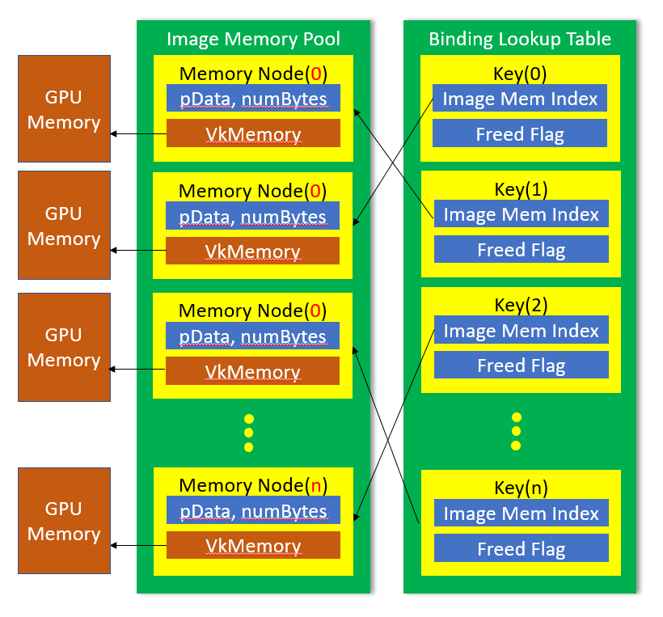
#### Memory Management for images
Image buffer memory management is a lot simpler, since each image must bind a different memory object(I'm not sure why). So image buffer pool doesn't update a binding list for multiple images. And a binding info table is not necessary too. The only thing left same as buffer memory management is lookup table, which is used for key->memory node indexing. Do remember the key is also kept inside every image.

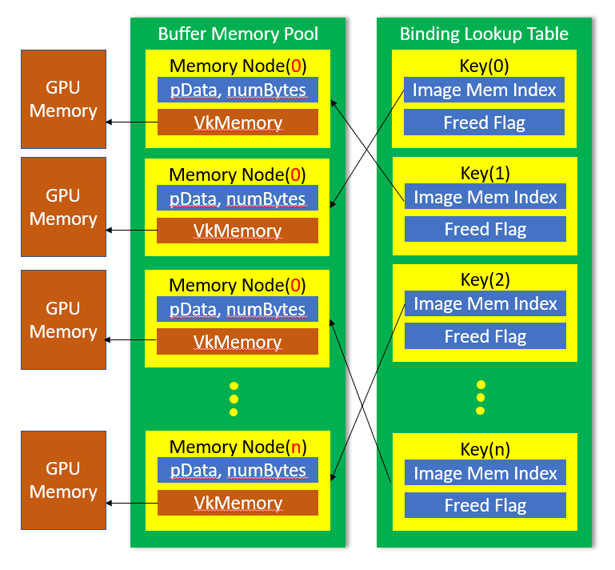
### Buffer & Image Level Management
I created a class "SharedBufferManager" to manage a big buffer from which varies types of buffers will allocate. During the time of command buffer generation, this big buffer will be bound along with an offset and range. I do this to follow the best practice of NVdia's document, without knowing why;). I do know that for uniform buffers, binding them with "vkoffsets" is a lot cheaper than switching descriptor sets, not to mention update them. This way I can avoid either switching and updating descriptor sets, seems like a perfect path to go.

Every buffer are I use is created from this "SharedBufferManager". It contains a key that is used to index to its owne sub-region of the "SharedBufferManager" buffer with information like "numBytes" and "offset". And the class  "SharedBufferManager" buffer is a normal buffer which also has another types of key that could be used to index in memory manager to find its information and Vulkan object "VkDeviceMemory". The final graph is something like this (Red one "Shared Buffer" stands for kind of buffer that the application actually use):

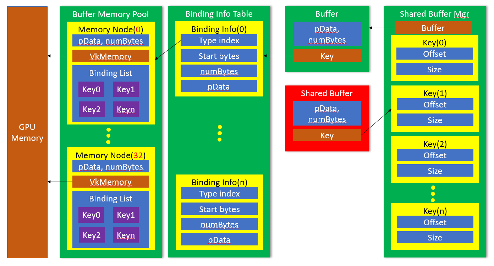

There're multiple shared buffer managers, and each one of them is used with a specific purpose:
 1. Each vertex buffer is allocated from a specific shared buffer manager associated with a vertex format.
 2. Each index buffer is allocated from global shared buffer manager.
 3. Each indirect buffer is allocated from global shared buffer manager.
 4. Each uniform buffer is allocated from global shared buffer manager.
 5. Each shader storage buffer is allocated from global shared buffer manager.
 6. Each texture is allocated directly with a  segment of memory.
 
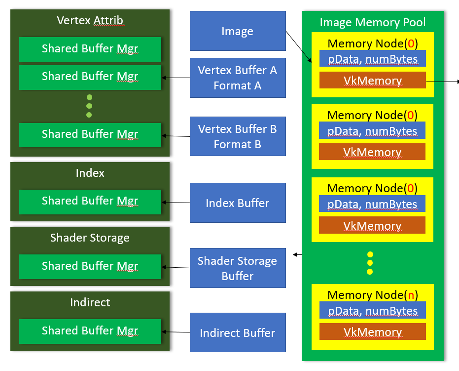

## Material Structure
Each material contains 4 descriptor sets, corresponding to global, per-frame, per-object and material.

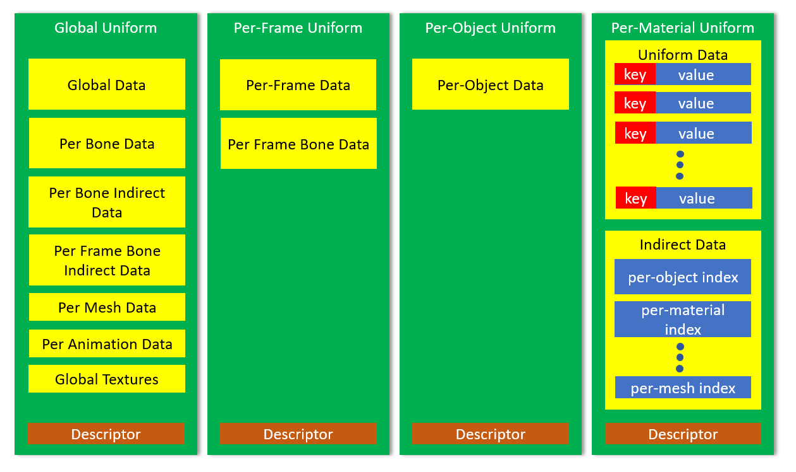

 - **Global Uniform** is the most sophistic data set in my application, as most of data is not gonna change in both per-frame and per-object basis. It consists of some buffers and textures.
	 - **Global Data**: Mostly stores something like projection matrix, camera settings and ssr settings which are configured globally.
	 - **Per Bone Data**: All bones' default transformation in dual quaternion.
	 - **Per Bone Indirect Data**: Indices of all bones' data in **Per Bone Data**.
	 - **Per Frame Bone Indirect Data**: Indices of all per-frame bones' data in **Per Frame Bone Data**.
	 - **Per Mesh Data**: All meshes' data.
	 - **Per Animation Data**: All animation instances' data.
	 - **Global Textures**: All the textures and texture arrays are stored here.
 - **Per-Frame Uniform**'s data will be changed in a per-frame basis.
	 - **Per Frame Data**: Something like view matrix, camera position & direction, delta time, etc.
	 - **Per Frame Bone Data**: All the bone transforms calculated in a frame will be stored here. The data can be indexed by **Per Frame Bone Indirect Data** in **Global Uniform**
 - **Per-Object Uniform** Information in a per-object basis, like model matrix.
 - **Per-Material Uniform** is somehow different. It's actually configurable rather than pre-defined. 
	 - **Per-Material Data**: Since it's required that you have to provide a customized parameter layout if you wanna create a material, you can directly set data into the buffer through a key and a material chunk index(for different data instance of a same material), and material will automatically figure out where to store this data.
	 - **Indirect Data**: All the indirect indices of an object, including per-object index, per-material index, per-mesh index and per-animation index.
 ### Material to Mesh Renderer
Simply a material class is not enough. I need multiple instances of the same material that holds different values, and a way to hookup these instances to actual mesh vertices.

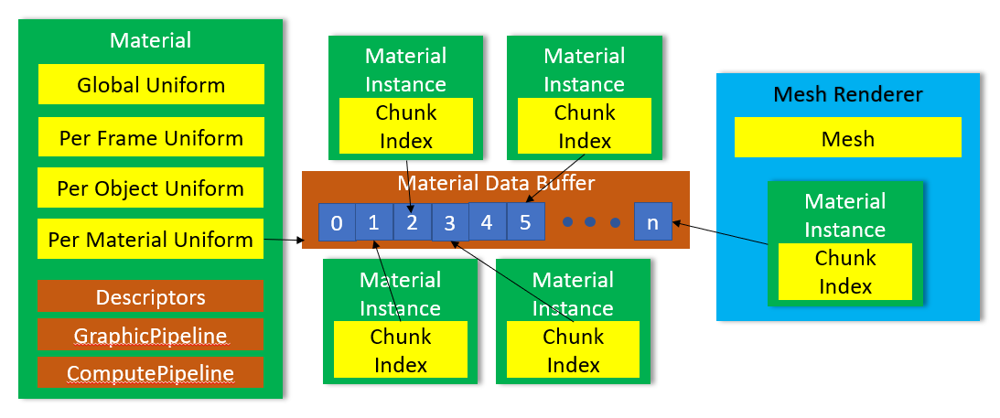

 - **Material**: Holds Descriptors of **Global Uniform**, **Per-Frame Uniform**, **Per-Object Uniform** and **Per-Material Uniform**. It also holds Vulkan objects like descriptor pipeline layout, descriptor pool and graphic(compute) pipeline, etc.
 - **Material Instance**: It acquires a chunk index from **Material** when initialized, through which you can look for its instance data in **Material**'s **Per-Material Uniform**.
 - **Mesh Renderer**: This class is a component class that is used to attached to an object, and will be updated per-frame. It holds a mesh class reference and one or more **Material Instance**s. **Mesh Renderer** will generate a indirect draw struct and add it to **Material**'s dedicated buffer, and add its own per-object chunk index, per-mesh chunk Index, per-animation chunk index and per-material chunk index into **Material**'s **Indirect Data**. Therefore, I'm able to look for any data I need through "gl_drawID"(e.g. "gl_drawID"->**Indirect Data-**>per-material chunk index->**Per-Material Uniform**->instance data).
## Skeleton Animation System
First I'd like to show the whole data structure of the database like skeleton animation system.

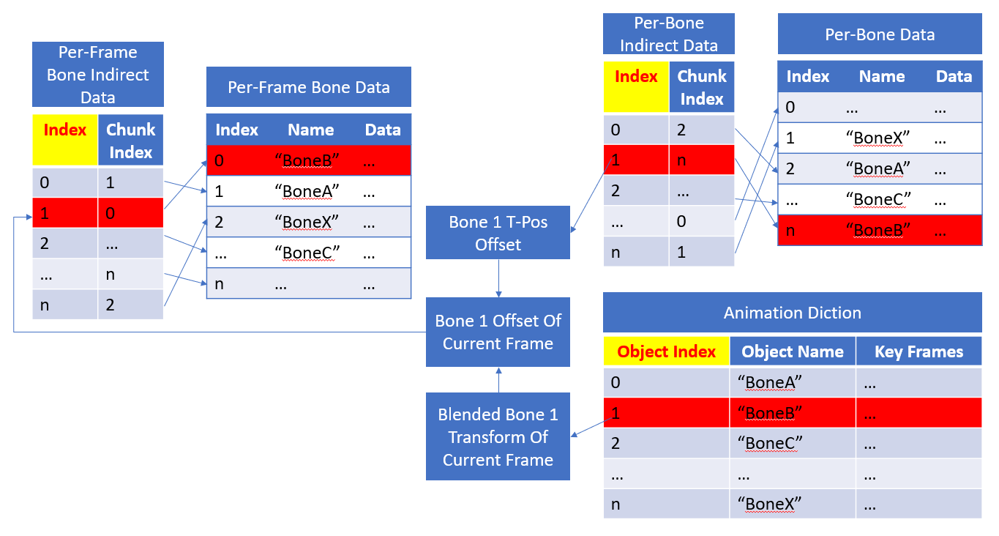

During initialization of a scene, if a bone structure is detected in a mesh, its information will be stored into Animation Diction(Animation information, per-object key frame information), Per-Bone Indirect Data(Used to index to per-bone data) and Per-Bone Data(Holds t-pos default bone transforms for all bones). When a model with skeleton animation is about to render, we have to acquire 2 transforms:

 1. **T-Pos Reference Transform**(): Transforms default vertices into bone local space.
 2. **Blended Bone Transform**(): A transform that is blended according to a time and related 2 key frames.

Both  and  combined with object's model view projection  matrix, we can have final clip space position  of a frame:

However, we can't just simply multiply all of them that easily. Since we need **Dual Quaternion Interpolation** to acquire a final bone transform among multiple bones. Therefore, result matrix of  will be converted into dual quaternion and set to **Per-Frame Bone Data**, and vertex shader could get this through its bone indices and **Per-Frame Bone Indirect Data**. Shader will do interpolation and transform work, and the rest will be exactly the same as a normal model.

If you're interested in dual quaternion, I just happen to mark some concepts of it down in [here](DualQuaternion.md).

## Render Graph

### GBuffer Pass
Here's the layout of my GBuffer. You can see some channels are marked as reserved. It's just because I'm too lazy to remove, besides, I might add something that requires one or more channels in future:)

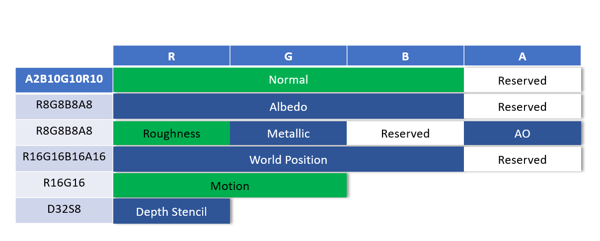

You could notice that there's no position in GBuffer, since positions are reconstructed using depth buffer, and it saves tons of bandwidth per-frame. In order to acquire an accurate world space position that is pretty far away from camera, I use reverted depth buffer, i.e. near plane depth 1 and infinite far plane 0. The reason doing this is that floating point tends to spend more of its bits towards 0. If you don't use reversed depth, the nonlinear depth output from a projection matrix plus a non-uniform accuracy distribution of float is gonna ruin the whole reconstruction. However, a reverse would completely change the whole situation, as they two will cancel out each other's distribution, resulting a more balanced distribution(still not uniform though).
### Skinned GBuffer Pass
This pass does exactly the same job as **GBuffer Pass**, except that it deals only with meshes that has bones and weighted skin vertices.
### Background Motion Pass
We can render motion vector through various objects shown on the screen. However for those pixels that are never touched by any of them, no motion vectors will be produced. This doesn't seem like a problem for skybox since it doesn't move with character. But it'll fail if a character rotates its view direction, motion blur is not able to apply here. Therefore, an extra pass here to fill the gap, to record motion only caused by view rotation.
### Motion Tile Max Pass && Motion Neighborhood Max
These 2 passes mainly convert per pixel motion into tile, and each tile contains larges motion it records within its rect. The result is used both in **Temporal Resolve Pass** and **Post Process Pass**.