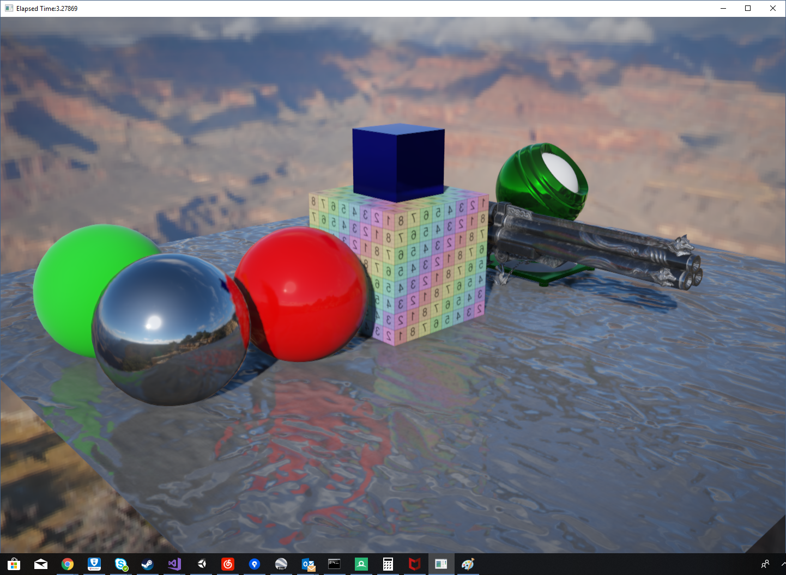
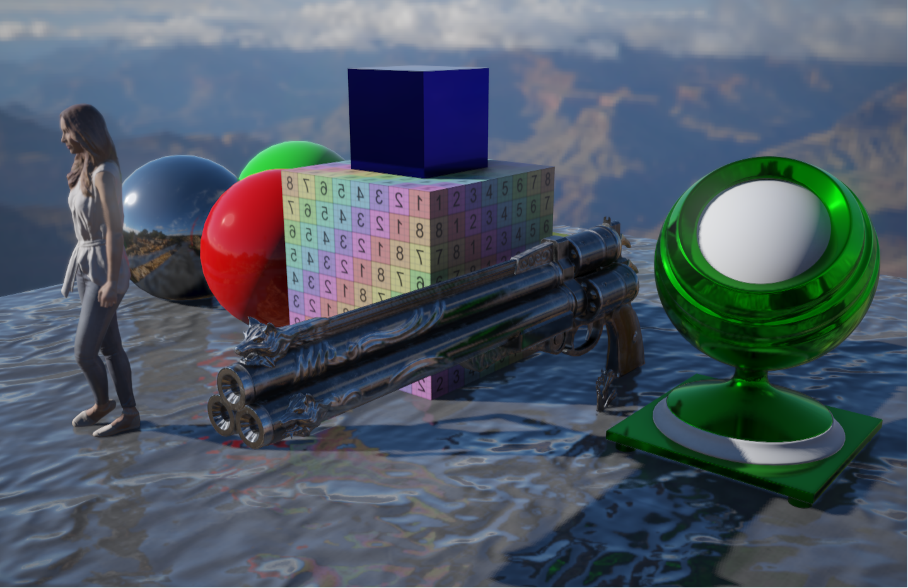
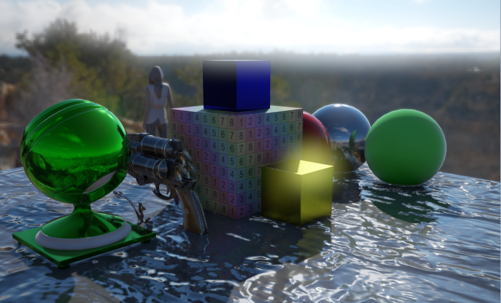
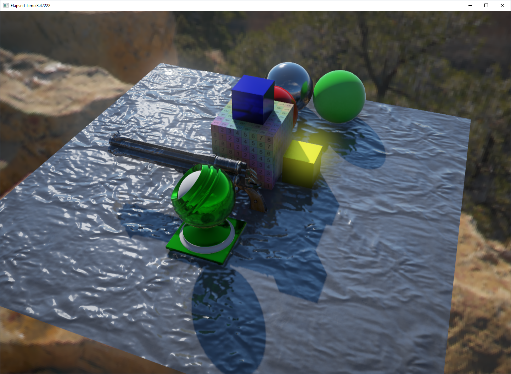
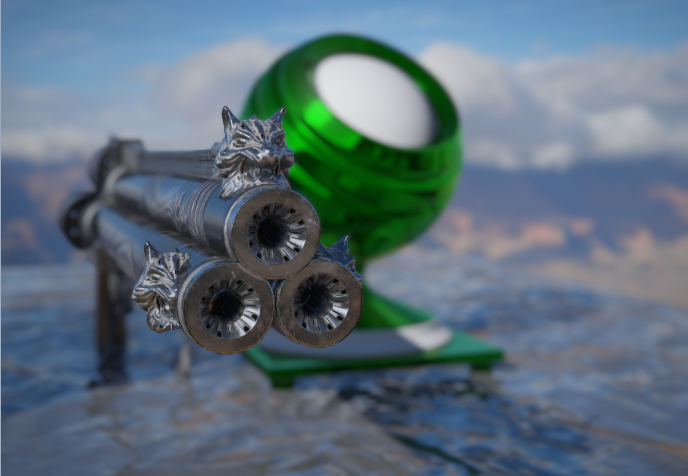
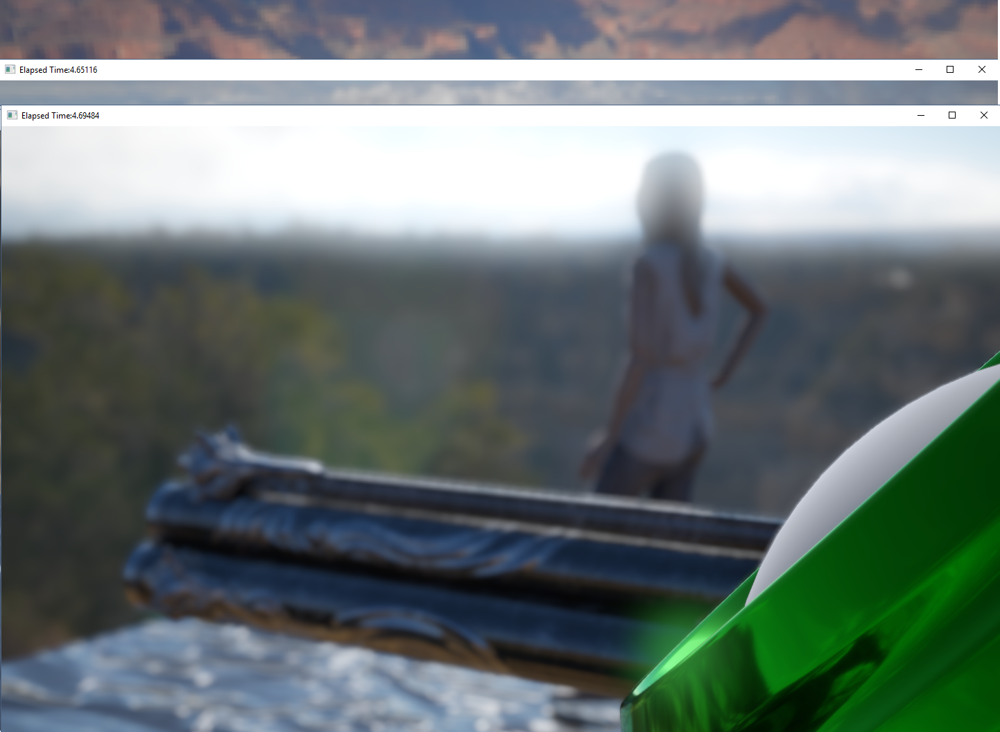
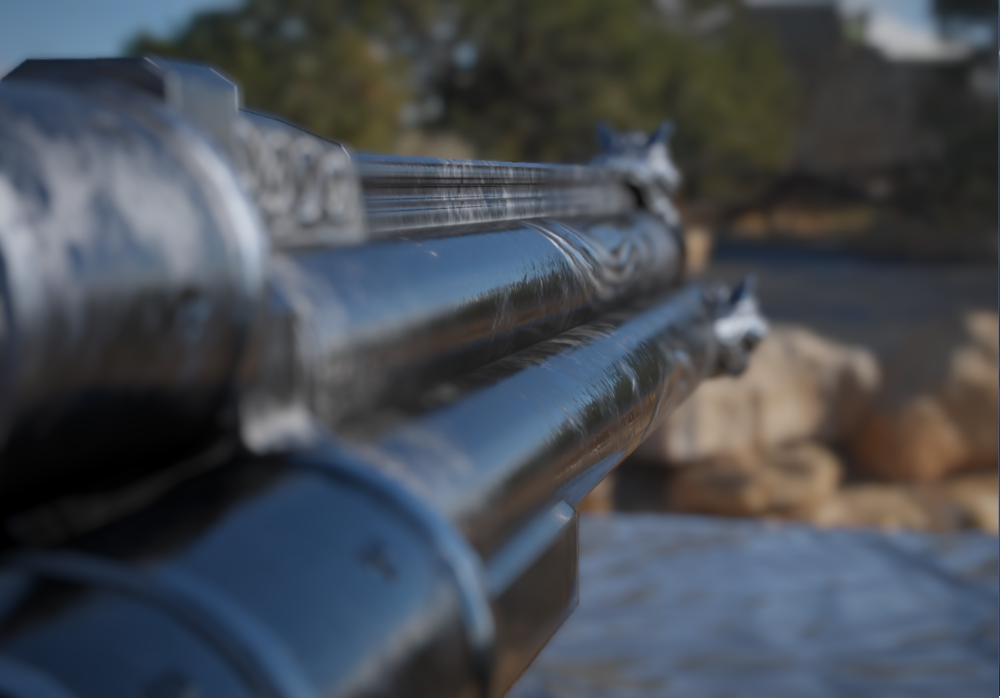
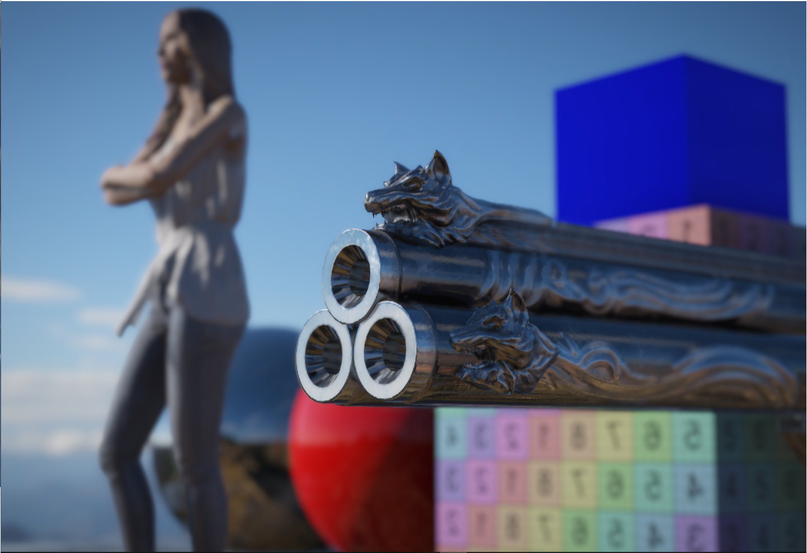
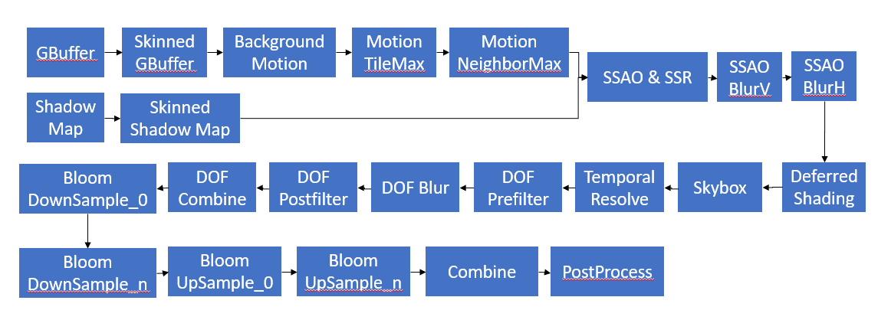

A 3D sample project that is used for my Vulkan practicing.

What I've implemented:
1. AZDO and batching by material
2. Deferred
3. Shadow Map
4. SSAO
5. Bloom(Improved multi pass blur)
6. Motion Blur(With improved tilemax and neighborhood max)
7. Temporal AA
8. Stochastic Screen Space Reflection(Try to implement according to the docs of Frostbite)
9. Physical Based Camera(prerequisites of DOF)
10. DOF

What I want to do later:
1. Clusterred Deferred
2. Cascade Shadow Map

What needs to improve:
1. SSSR on rough materials, to reduce variance that seriously impact visual quality.
2. Simplify TAA's parameters.

Since the variance of SSSR on rough surface is large, I did some tricks in TAA's shader to automatically adjust its response according to maximum tiled neighborhood motion vector.
However, it's quite tricky to adjust all the parameters to achieve a good result. It forces me to trade variance with blurness in the end.

Variance reducing is the only solution.

# A Graphic Sample Rendered By Vulkan
## Introduction
I created this project aiming to get familiar with Vulkan through varies common rendering technologies. It is also a minor engine that handles scene management and data to coordinate with underlay Vulkan and get things drawn on screen. I've already added a lot of functionalities helping to create a scene by a few lines of code. However, there's still a vast gap between this project and a common game engine, both in terms of utilities that helps to ease the work, and a UI editor to do things dynamically rather than code stuff and rebuild.
## Render Graph

