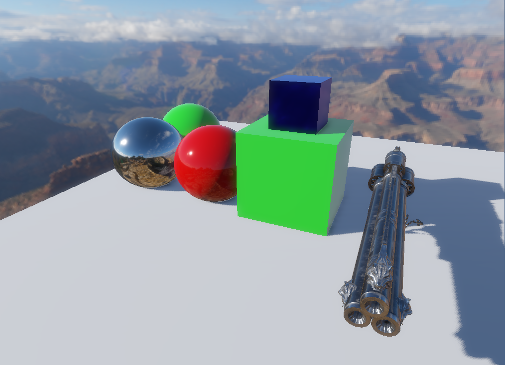

A 3D sample project that is used for my Vulkan practicing.

What I've implemented:
1. AZDO and batching by material
2. Deferred
3. Shadow Map
4. SSAO
5. Bloom

What I want to do later:
1. Temporal AA
2. Motion Blur
3. SSR
4. DOF
5. Clusterred Deferred
6. Cascade Shadow Map

